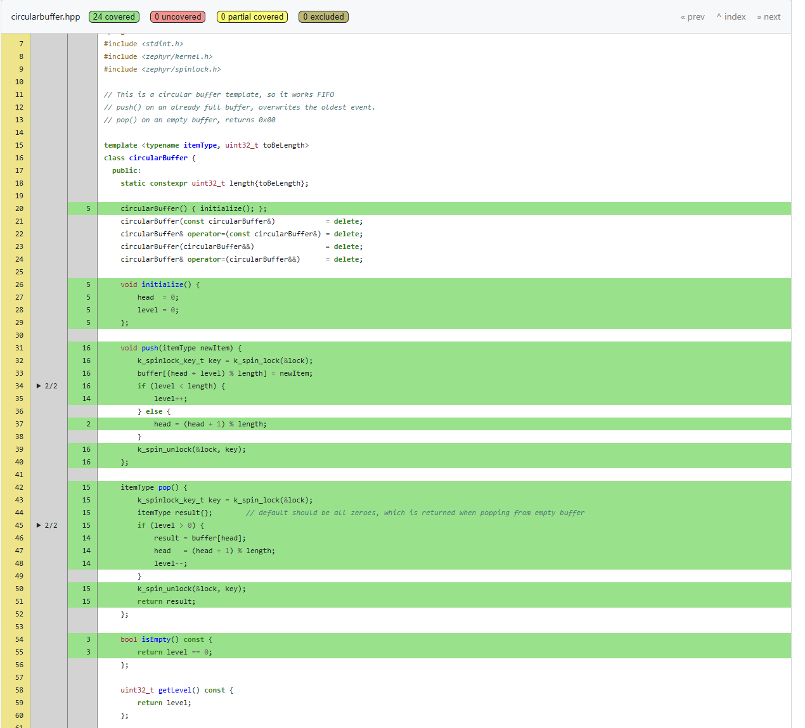

# Note to IOMICO reviewer - Homework Lesson 8.1 and 8.2
I applied the unit testing onto a circularbuffer (template) class of my own. (app/lib/circularbuffer/circularbuffer.hpp).  
I already had unit tests for this class, so I ported them to ZTEST.
I always use coverage to detect edge cases, so I combined both homeworks into one.
As each test creates a new circularBuffer instance on the stack, there is no need for shuffling the tests.




# Note to IOMICO reviewer - Homework Lesson 7.2
I have added some shell commands to read out the BME680 sensor on my custom board : 
```
msense : show help
msense temp [C|F] : show temperature, in Celsius or Farenheit
msense hum : show humidity
```

I added some command handlers directly into main.cpp.  They handle 3 commands, check the parameters and call the sensor API to get the data.  
After enabling the sensor shell in prj.conf, I was able to verify the readings from both shell interfaces : 

```
sensor get bme680
channel type=13(ambient_temp) index=0 shift=16 num_samples=1 value=5534930645ns (21.269989)
channel type=14(press) index=0 shift=16 num_samples=1 value=5534930645ns (101.364990)
channel type=16(humidity) index=0 shift=16 num_samples=1 value=5534930645ns (48.254974)
channel type=40(gas_resistance) index=0 shift=16 num_samples=1 value=5534930645ns (1155.457855)


msense temp C
Temperature: 21.28 C

msense hum
Humidity: 48.18 %
```

# Note to IOMICO reviewer - Homework Lesson 7.1
For the homework on Zephyr Shell, I decided to try the EEPROM_SHELL, as my mumo_v2 custom board which has two BR24G512 chips on the I2C bus.  
So first step was to add the eeprom to the board.dts file. It turns out that even if it are 2 separate chips, Zephyr's driver can handle it as a single 128K memory range (good, because that's also how I did it in bare metal driver).  
Then I needed to add a few configs to enable the EEPROM shell in prj.conf  
After building and flashing, I was able to get the eeprom size, fill some part of it and read it back. Nice!

```
eeprom fill eeprom 0x20 16 0xEE
Writing 16 bytes of 0xee to EEPROM...
Verifying...
Verify OK
```

```
eeprom read eeprom 0x0 64
Reading 64 bytes from EEPROM, offset 0...
00000000: 01 ff ff ff 02 ff ff ff  ff ff ff ff ff ff ff ff |........ ........|
00000010: ff ff ff ff ff ff ff ff  ff ff ff ff ff ff ff ff |........ ........|
00000020: ee ee ee ee ee ee ee ee  ee ee ee ee ee ee ee ee |........ ........|
00000030: ff ff ff ff ff ff ff ff  ff ff ff ff ff ff ff ff |........ ........|
```

# Note to IOMICO reviewer - Homework Lesson 6.2
I made the delay for blinking the LED a parameter in the driver. I can be set from the dts in app.overlay  
At the entry of main(), the active delay is read from the driver and printed to serial monitor.
Small hickup : I added a l6driver.h file, but as I am using C++ (at least main.cpp) I needed to wrap it in "extern "C" {}" to prevent name mingling. Without it I got a linker error.. Makes sense.

# Note to IOMICO reviewer - Homework Lesson 6.1
I've written a new driver which implements 2 functions of the sensor API (sample_fetch and .channel_get).
I decided to keep the driver in the app folder, as this is what's being pushed to the repo. If it would be in a separate module in the west workspace, it would not be pushed to git remote and inaccessible for review.
The board used is the lora_e5_dev_board/stm32wle5xx as this has a LED, and I can easily flash it and use the serial monitor on it.

# Note to IOMICO reviewer - Homework Lesson 5.2
Tried to create a board definition from scratch, this time using another custom board I made as shown in boards/toolsquare/doc/image.png  
I was able to make a hello_world application build, flash and work. There are still many areas for which I am unsure :
* what about partition tables...
* how to deal with two cores procpu / appcpu, eg. how to I make sure the wifi stack runs on its own cpu ?
* there was a glitch in that my ESP32-WROOM SOC HW was Revision 1, and Zephyr requires V3. I could fix by CONFIG_ESP32_USE_UNSUPPORTED_REVISION=y (without this, the device does not boot)

Now I can move forward and start to add more hardware to this board :
* I2C - several devices on it (PN7150, MCP23008, etc..) some are supported by Zephyr, some are not :-(
* SPI : there is a display, driver is supported by Zephyr, will also need LVGL, There is also a touchscreen controller on this SPI
* I2S audio output

About the board.c file printing a message at boot : sorry I was unable to complete this in time due to lack of time..

# Note to IOMICO reviewer - Homework Lesson 5.1
I decided to try to port a custom board I designed some time ago to Zephyr. Seeed Studio offers a devkit with the same SoC/Module and so I could copy/paste/modify from their definition.
This custom board is ultra-low-power (1.4 uA in sleep), so it does not have any leds. But I was able to bring the board up with a hello-world via uart2 (devkit uses uart1). Also this board has a BME680 sensor on I2C2, and I was able to activate the driver and do simple readings of temperature and humidity. 
I still have a few todo's for the DTS for this board :
* The board also has 128K of EEPROM on I2C2
* The board has an e-paper display, connected to SPI2 work
* Finally, this board should go to sleep when idle, which is one more thing I need to find out how to do that.


# Note to IOMICO reviewer - Homework Lesson 4
For this homework I decided to try a different board : the M5Stack AtomS3. Instead of blinking LEDs, I decided to try RGB ledStrips (WS2812 leds). In Zephyr there are a few different ways to drive them, I decided to try the SPI-driver first. This requires the app.overlay to contain the definitions on which pins to transmit the MOSI, and some timing parameters. Also the length of the led-strip (in number of leds/pixels) is set in the DTS overlay file. Some applicaction timing parameter is defined in Kconfig.  
Changes :  
* upgraded west.yml to zephyr 4.4 and adding espressif hal.
* added an 'rgb' library to do calculations on rgb colors.
* added app.overlay to include/enable the external hw. (SPI3 is used because SPI2 is used for the display and I may want to use both at the same time in a future project).
* added Kconfig with parameters needed for the ledstrip driver.
* some other libraries are under 'lib', they are for future use.

# Note to IOMICO reviewer - Homework Lesson 3
I made a variant of the homework : a Kconfig fragment for a 'breathing led' library.  
When the library is enabled, you can 
* choose the breathing speed, in a range.  
* select which hw mechanism to choose :
    * fading using PWM on normal LED
    * fading using a WS2818 led
* When you select the WS2818 led, an extra option appears where you can choose the color of the led from a list

I will implement the library and related DTS for the Lesson 4 homework.


# Note to IOMICO reviewer - Homework Lesson 2
I read a lot about West Workspaces and how they could and should be used with Zephyr.  
I've decided to set up 2 template repo's :
1 a workspace repo - called the 'top dir' in zephyr docs.
2 a template for the so-called 'manifest repository', ie. the application and all its dependencies, found in a '/app' subfolder of the workspace

I think there should be a separate repo for ```west workspace``` (1) and ```zephyr project``` (2) :
* workspace repo will normally not change / project repo will change a lot
* developer willing to work on (2) may have their own, different workspaces
* note that having the top directory as .git repo is NOT supported / recommended by zephyr https://docs.zephyrproject.org/latest/develop/west/workspaces.html#not-supported-workspace-topdir-as-git-repository

The Iomico repo is a template for a zephyr project (not zephyr workspace), so it's contents should be cloned under /app of the workspace. However, this repo already contains an app folder itself... confusing. So I decided to reorganize it, and move all app folders up one level.

Other improvements done : 
* CMakeLists.txt : ```find_package(Zephyr REQUIRED HINTS $ENV{ZEPHYR_BASE})``` io. ```find_package(Zephyr REQUIRED)```
* prj.conf : added ```CONFIG_CPP=y``` As main.cpp indicates development will be in C++, might as well activate this in KConfig as it will be needed in libraries.
* src/main.cpp : several cleanups   
    * use ```static constexpr uint32_t sleepTimeInMs{1000};``` io ```#define SLEEP_TIME_MS 1000``` as it will result in a symbol in the debugger and thus makes the code more readible
    * also made gpio_dt_spec constexpr io const
    * move ```LOG_MODULE_REGISTER(main, LOG_LEVEL_INF);``` to top.
* better .gitignore file
* .clang_format file for automatic code formatting

# Zephyr Training Environment

Welcome to the Zephyr RTOS training! This repository includes a ready-to-use
development environment based on Zephyr 4.3.0, which you can set up in one of
three ways:

---

## Manual Zephyr Setup

Follow the following guide:
- [Getting Started Guide](https://docs.zephyrproject.org/latest/develop/getting_started/index.html#).

Make sure to select appropriate OS and to perform all steps till
[Build the Blinky Sample](https://docs.zephyrproject.org/latest/develop/getting_started/index.html#build-the-blinky-sample).
